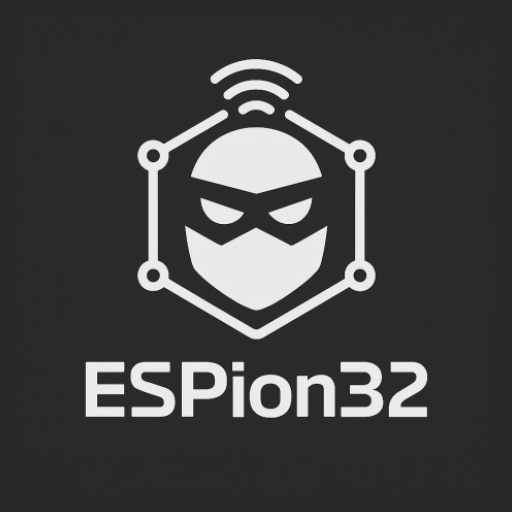

# ESPion32 – OffSec Wifi Tool

> **ESPion32** is an ESP32 project which uses an Android application to set up wifi attacks on the provided ESP32 such that sniffing or deauthentication... This application communicates with the ESP32 via BLE. As the project aims to perform offensive attacks on wifi, for obvious reason, the firmware written in C by myself, is not provided. This project is for educational purpose only. Unauthorized scanning or attacking of networks is prohibited. Use this application solely on systems you own or have explicit permission to evaluate.

  

---

## Table of contents

1. [Features](#features)
2. [Screenshots](#screenshots)

---
